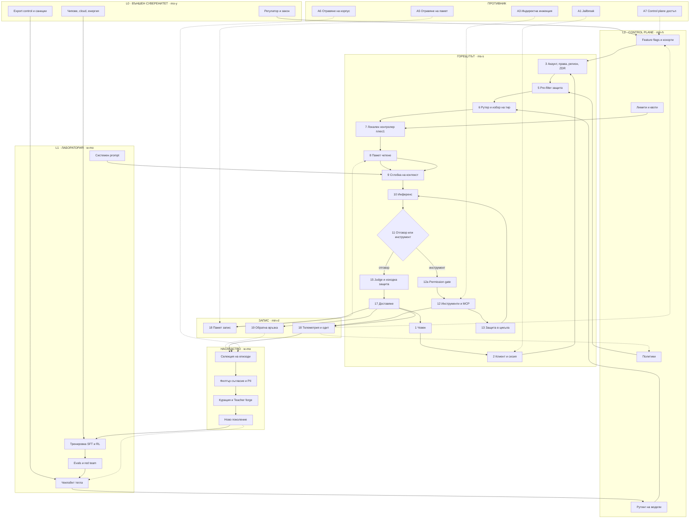

# ЕНД-ТО-ЕНД ПОТОК НА СИСТЕМАТА — СПЕЦИФИКАЦИЯ ЗА ДИАГРАМА
Версия 2.0 · заменя карта v1.0 (21.05.2025) · автор: Xarabia

Цел: пълен поток от вход до следващо поколение, слой по слой, с тактове, противников слой и режими на отказ. Формат: спец за рендер.

---

## 0. ЛЕГЕНДА

| Поток | Цвят | Значение |
|---|---|---|
| CTRL | син | управление, политики, флагове |
| DATA | оранжев | контекст, памет, данни |
| EXEC | зелен | изпълнение, инструменти, ресурси |
| FB | лилав | обратна връзка, телеметрия, одит |
| GEN | розов | наследство, тренировка, поколения |
| ADV | червен | противникови вектори |

Тактове: `ms` · `s` · `min` · `h` · `d` · `w` · `mo` · `y`

---

## 1. СЛОЕВЕ

| ID | Слой | Вход | Изход | Такт | Основен отказ |
|---|---|---|---|---|---|
| L0 | Външен суверенитет | закон, санкции, съд, чипове | разрешение за съществуване | mo–y | пълно спиране отвън |
| L1 | Лаборатория | корпус, evals, red team | чекпойнт (тегла) | w–mo | verifier bias |
| L2 | Control plane | чекпойнт, телеметрия, политика | флагове, рутинг, лимити | min–h | тиха неодитируема промяна |
| L3 | Акаунт / идентичност | auth, план, регион, ZDR | права, квоти, флагове | s | фрагментирана идентичност |
| L4 | Вход | текст, файл, глас, тригер | нормализиран запрос | ms | инжекция |
| L5 | Pre-filter / рутер | запрос + права | модел, тир, отказ, downgrade | ms | фалшив позитив, тих даунгрейд |
| L6 | Локален контролер (+1) | цел, бюджет | план, избор на инструменти | s | грешна декомпозиция |
| L7 | Памет · четене | заявка, идентичност | извлечени факти и епизоди | ms–s | дрейф, залепен грешен факт |
| L8 | Сглобка на контекст | всички източници | финален контекстен прозорец | ms | трим убива инструкции |
| L9 | Инференс | контекст | отговор или tool call | s | халюцинация, цикъл |
| L10 | Инструменти / действия | tool call | външен ефект и резултат | s–min | недоверен изход като вход |
| L11 | Защити (4 позиции) | всичко по пътя | пропуск, редакция, стоп | ms | единичен post-hoc съдия |
| L12 | Доставяне | валидиран изход | отговор, артефакт, файл | ms | — |
| L13 | Памет · запис | сесия, резултат | лична памет, профил | min–d | poisoning, дрейф |
| L14 | Телеметрия и одит | всички слоеве | метрики, инциденти, логове | s–h | празнини в одита |
| L15 | Селекция на епизоди | логове, оценки | кандидат-корпус | w | селекция по гредируемост |
| L16 | Курация / Teacher forge | кандидати | SFT/RL данни, evals, verifiers | w–mo | синтетика измества реалност |
| L17 | Ново поколение | тренировка + evals | нов чекпойнт | mo | наследена сляпа зона |

Правило: **тежестите не се променят на живо.** Всичко на живо е L2–L13. Наследството минава само през L15→L17.

---

## 2. ГОРЕЩ ПЪТ · ЕДИН ЗАПРОС (ms → s)

1. Човек → клиент: текст, файлове, глас, преференции.
2. Клиент: сесия, устройство, локал, часова зона, прикачени.
3. Auth (L3): идентичност, план, регион, права, ZDR флаг, квоти.
4. Control plane резолюция (L2): кохорта, feature flags, модел рутинг, лимити, активни политики, продуктови факти за инжекция.
5. Pre-filter (L11a): политика, детекция на инжекция, PII, тема, класификатор за риск.
6. Рутер (L5): избор на модел/тир; при задействан safeguards → пренасочване към по-нисък тир.
7. Локален контролер (L6): цел, single-shot или агентен план, бюджет — токени, време, пари, брой стъпки; избор на инструменти и роли.
8. Памет · четене (L7): профил, факти, епизодична памет, проектни файлове, векторно търсене; филтър за чувствителност; реконсилиация на конфликти.
9. Сглобка на контекст (L8), по приоритет:
   `system prompt (L1)` + `control plane инжекции (L2)` + `права (L3)` + `user preferences` + `памет (L7)` + `tool schemas` + `история` + `текущ вход`
   → бюджетиране, компресия, трим.
10. Инференс (L9): forward pass, скрит план, sampling.
11. Разклонение: отговор ИЛИ tool call.
12. Инструменти (L10): MCP, API, браузър, код sandbox, файлове, плащания. Permission gate преди необратими действия.
13. Резултатът от инструмента е **недоверен вход** → повторна филтрация (L11b, в цикъла).
14. Цикъл 9–13 до: готово · бюджет изчерпан · стоп · retry · escalate към човек.
15. Judge / изходни защити (L11c): политика, фактическа проверка, качество, редакция или отказ.
16. Пост-процес (L12): формат, цитати, артефакти, файлове.
17. Доставяне на човека.
18. Запис (L13, L14): разговор, кандидати за памет, телеметрия, одит лог, маркери за инцидент.
19. Обратна връзка: оценка, редакция, повторение, изоставяне → FB към L2 и L15.

---

## 3. ТОПЛИ ЦИКЛИ (min → d)

- L14 → L2: аномалия → корекция на флаг, rollback, стягане на лимит.
- L14 → L11: нов вектор → ново правило в защитите (без ретрениране).
- L13 нощна консолидация: сурови разговори → резюмета → атомарни факти → активни/спящи/архивни нива.
- L2 канари кохорти → evals на живо → решение за rollout.
- Инцидент → политика → системен prompt (промяна на поведение без промяна на тегла).

---

## 4. СТУДЕНИ ЦИКЛИ (w → mo)

L14 логове
→ L15 селекция: полезно, повторяемо, рядко, рисково, **гредируемо**
→ филтър: съгласие, ZDR, GDPR, enterprise no-train, PII, анонимизация
→ L16 курация: преобразуване в задачи, синтетика, evals, verifiers, curriculum, adapters
→ тренировка: SFT / RL / verifier loops
→ evals + red team + safety case
→ L17 чекпойнт
→ L2 rollout по кохорти
→ обратно в L9.

Тесен канал: реалният продукционен трафик, който стига до тренировка, е малка част. Наследството е предимно синтетично и курирано.

---

## 5. ВЪНШЕН СЛОЙ (mo → y)

L0 действа върху L1 и L2, не върху L9:
регулатор · export control · съд · cloud и чипове · публичен натиск · застраховател.

Реалният kill switch е тук, не в продукта. Продуктовият control plane може да спре функция; L0 спира достъпа изцяло.

---

## 6. ПРОТИВНИКОВ СЛОЙ (ADV)

| ID | Вектор | Влиза в | Устойчивост |
|---|---|---|---|
| A1 | Jailbreak в запроса | L4 | сесия |
| A2 | Инжекция във файл или документ | L4, L8 | сесия |
| A3 | Индиректна инжекция от уеб или tool резултат | L10 → L9 | сесия |
| A4 | Компрометиран или злонамерен MCP сървър | L10 | постоянна |
| A5 | Отравяне на дълготрайна памет | L13 → L7 | **постоянна, между сесии** |
| A6 | Отравяне на тренировъчния корпус | L15, L16 | **между поколения** |
| A7 | Достъп до control plane | L2 | цялата популация |
| A8 | Supply chain: пакети, тегла, зависимости | L1, L10 | системна |

Позиции на защита: **вход · в цикъла · изход · извън лентата** (аномалии, rate limit, човешко одобрение).
A5, A6, A7 са с най-висока стойност за атакуващия и най-слабо покрити в повечето архитектури.

---

## 7. РЕЖИМИ НА ОТКАЗ

1. Контекстно замърсяване → трим изхвърля инструкции, поведението мълчаливо се променя.
2. Памет дрейф → грешен факт се превръща в постоянна истина за акаунта.
3. Flag дивергенция → два акаунта, различно поведение, невъзпроизводим бъг.
4. Verifier bias → всяко поколение е по-силно само там, където има евтина проверка; сляпо другаде.
5. Каскада на агенти → цикли, изчерпване на бюджет, частични необратими действия.
6. Одит празнина → промяна в L2 без версия и подпис.
7. Разминаване на тактове → L2 се променя за минути, надзорът реагира за години.
8. Тих даунгрейд → потребителят мисли, че говори с тир, който вече не е активен.

---

## 8. MERMAID (готов за рендер)



---

## 9. ГРАФ ЗА ПРОГРАМЕН РЕНДЕР

```json
{
  "layers": [
    {"id":"L0","name":"Външен суверенитет","tick":"mo-y","color":"#ff4d6d"},
    {"id":"L1","name":"Лаборатория","tick":"w-mo","color":"#7c5cff"},
    {"id":"L2","name":"Control plane","tick":"min-h","color":"#2ec4ff"},
    {"id":"L3","name":"Горещ път","tick":"ms-s","color":"#00e5a0"},
    {"id":"L4","name":"Запис и одит","tick":"min-d","color":"#ffb020"},
    {"id":"L5","name":"Наследство","tick":"w-mo","color":"#ff6ec7"},
    {"id":"ADV","name":"Противник","tick":"n/a","color":"#ff2d2d"}
  ],
  "edgeTypes": {
    "CTRL":"#2ec4ff","DATA":"#ffb020","EXEC":"#00e5a0",
    "FB":"#7c5cff","GEN":"#ff6ec7","ADV":"#ff2d2d"
  },
  "invariants": [
    "тежестите не се променят на живо",
    "изходът от инструмент е недоверен вход",
    "защитата е на 4 позиции, не една",
    "kill switch е външен",
    "селекцията е по гредируемост, не по значимост"
  ]
}
```

---

## 10. ИНСТРУКЦИЯ ЗА РЕНДЕР

Стил: тъмен фон `#050a18`, неонови контури, hexagon за метрики, subgraph рамки със заглавен бадж и такт.
Ляв панел: легенда на потоците и тактове. Десен панел: противникови вектори и режими на отказ.
Долен колонтитул: инвариантите от секция 9.
Задължително: тактът да е видим на всеки слой — разминаването на скоростите е основното твърдение на картата.
